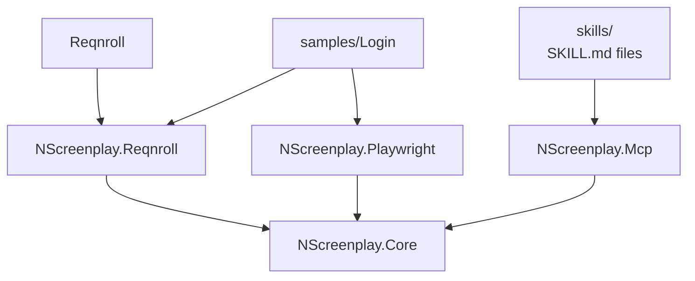

# NScreenplay

[](https://github.com/hadijahangiri/NScreenPlay/actions/workflows/ci.yml)
[](https://www.nuget.org/packages/NScreenplay.Core)
[](https://www.nuget.org/packages/NScreenplay.Playwright)
[](https://www.nuget.org/packages/NScreenplay.Reqnroll)
[](https://github.com/hadijahangiri/NScreenPlay/releases)
[](LICENSE)

An AI-native Screenplay Test Automation Framework for .NET.

NScreenplay organizes automation around the Screenplay flow:

Actor → Ability → Task → Interaction → Question → Consequence

That keeps tests readable for humans and discoverable for AI agents without hiding the real implementation.

## What Exists

- Screenplay core abstractions in `NScreenplay.Core`
- Playwright integration in `NScreenplay.Playwright`
- Reqnroll integration in `NScreenplay.Reqnroll`
- AI agent Skills under `skills/`
- MCP server in `src/NScreenplay.Mcp`
- Deterministic failure analysis
- Approval-gated healing proposals
- Parallel scenario isolation via per-scenario browser contexts

## Install

```bash
dotnet add package NScreenplay.Core --version 0.1.0
dotnet add package NScreenplay.Playwright --version 0.1.0
dotnet add package NScreenplay.Reqnroll --version 0.1.0
```

## Quick Start

```csharp
using Microsoft.Playwright;
using NScreenplay.Core;
using NScreenplay.Playwright;

static class LoginPage
{
    public static Target Username = Target.The("username field").ByTestId("username-input");
    public static Target Password = Target.The("password field").ByTestId("password-input");
    public static Target LoginButton = Target.The("login button").ByTestId("login-button");
    public static Target ErrorMessage = Target.The("login error message").ByTestId("login-error");
}

await using IPlaywright playwright = await Playwright.CreateAsync();
await using var browser = await playwright.Chromium.LaunchAsync(new BrowserTypeLaunchOptions { Headless = true });
await using var page = await browser.NewPageAsync();

var actor = Actor.Named("Alice");
actor.Can(BrowseTheWeb.Using(page));

await actor.AttemptsTo(Navigate.To("https://example.com/login"));
await actor.AttemptsTo(Enter.TheValue("alice@example.com").Into(LoginPage.Username));
await actor.AttemptsTo(Enter.TheValue("secret123").Into(LoginPage.Password));
await actor.AttemptsTo(Click.On(LoginPage.LoginButton));

var visible = await actor.AsksFor(Visibility.Of(LoginPage.ErrorMessage));
```

## Playwright

`BrowseTheWeb` wraps a Playwright `IPage` and is disposed when the `Actor` is disposed.

Supported interactions and questions include:

- `Navigate.To(url)`
- `Click.On(target)`
- `Enter.TheValue(value).Into(target)`
- `Select.TheOption(label).From(target)`
- `Check.The(target)` / `Check.Not(target)`
- `Text.Of(target)`
- `Visibility.Of(target)`
- `CurrentUrl.Value()`
- `PageTitle.Value()`
- `InputValue.Of(target)`

## Reqnroll

`NScreenplay.Reqnroll` provides:

- `BrowserManager`
- `ScenarioActor`
- `NScreenplayHooks`
- `ScenarioActorExtensions.InitializeFromFeatureBrowserAsync(...)`

The Login sample shows the supported flow with constructor-injected `ScenarioActor` and business-level step definitions.

## Skills

Skills are instructional `SKILL.md` files used by AI agents. They are not executable code.

They live in `skills/<name>/SKILL.md`:

- `skills/screenplay/SKILL.md`
- `skills/playwright/SKILL.md`
- `skills/reqnroll/SKILL.md`
- `skills/test-authoring/SKILL.md`
- `skills/test-review/SKILL.md`
- `skills/failure-analysis/SKILL.md`
- `skills/healing/SKILL.md`

The MCP server can list skills and return the full content of a named skill.

## MCP

Run the server with:

```bash
dotnet run --project src/NScreenplay.Mcp
```

Actual tools provided by `NScreenplay.Mcp`:

- `nscreenplay_get_framework_info`
- `nscreenplay_list_tasks`
- `nscreenplay_list_targets`
- `nscreenplay_list_interactions`
- `nscreenplay_list_questions`
- `nscreenplay_list_skills`
- `nscreenplay_get_skill`
- `nscreenplay_analyze_failure`
- `nscreenplay_analyze_requirement`
- `nscreenplay_create_test_plan`
- `nscreenplay_get_failure_context`
- `nscreenplay_get_fix_proposal`
- `nscreenplay_list_fix_proposals`
- `nscreenplay_reject_fix_proposal`
- `nscreenplay_approve_fix_proposal`
- `nscreenplay_apply_fix_proposal`
- `nscreenplay_get_audit_log`

The server is read-only for discovery and analysis, and the healing workflow requires explicit approval before file changes are applied.

## Healing

Healing is AI-assisted but not autonomous.

- proposals can be created
- proposals must be approved by a human
- proposals are not applied automatically
- the server does not execute shell commands
- the server does not run arbitrary repository content as instructions

## Architecture



## Project Structure

- `src/NScreenplay.Core` - core Screenplay abstractions
- `src/NScreenplay.Playwright` - Playwright integration
- `src/NScreenplay.Reqnroll` - Reqnroll integration
- `src/NScreenplay.Mcp` - MCP server
- `tests/NScreenplay.Core.Tests` - core tests
- `tests/NScreenplay.Playwright.Tests` - Playwright tests
- `tests/NScreenplay.Reqnroll.Tests` - Reqnroll tests
- `tests/NScreenplay.Mcp.Tests` - MCP tests
- `samples/Login` - end-to-end Login sample
- `skills` - AI agent instructions
- `docs` - supporting documentation

## Status

v0.1.0. This is an early public release, not a production-stability claim.

## Limitations

- Chromium is the only browser path implemented in `BrowserManager`
- `NScreenplayConfiguration` is a global set-once singleton
- healing rules are regex-based, not AST-based
- `NSCREENPLAY_WORKSPACE_ROOT` is required for healing file operations
- the MCP server is intentionally read-only for discovery and analysis
- the Login sample uses a self-contained HTML page, not a running web server

## Links

- [GitHub repository](https://github.com/hadijahangiri/NScreenPlay)
- [GitHub releases](https://github.com/hadijahangiri/NScreenPlay/releases)
- [NScreenplay.Core on NuGet](https://www.nuget.org/packages/NScreenplay.Core)
- [NScreenplay.Playwright on NuGet](https://www.nuget.org/packages/NScreenplay.Playwright)
- [NScreenplay.Reqnroll on NuGet](https://www.nuget.org/packages/NScreenplay.Reqnroll)

## More Docs

- [Getting started](docs/getting-started.md)
- [Screenplay pattern](docs/screenplay-pattern.md)
- [Playwright integration](docs/playwright.md)
- [Reqnroll integration](docs/reqnroll.md)
- [Skills](docs/skills.md)
- [MCP](docs/mcp.md)
- [AI](docs/ai.md)
- [Healing](docs/healing.md)
- [Architecture](docs/architecture.md)
10. **Test Runner Independence**: Works with any .NET test framework.

See [PRINCIPLES.md](docs/PRINCIPLES.md) for the complete list.

## Project Structure

```
NScreenplay/
├── .github/
│   ├── agents/
│   │   └── nscreenplay-architect.agent.md
│   └── skills/
├── src/
│   ├── NScreenplay.Core/           # Core abstractions (independent)
│   ├── NScreenplay.Playwright/     # Playwright integration
│   ├── NScreenplay.Reqnroll/       # Reqnroll/BDD integration
│   ├── NScreenplay.Api/            # API testing ability
│   ├── NScreenplay.Mcp/            # MCP tool provider
│   ├── NScreenplay.Ai/             # AI provider abstraction
│   └── NScreenplay.Cli/            # CLI tooling
├── tests/
│   ├── NScreenplay.Core.Tests/
│   ├── NScreenplay.Playwright.Tests/
│   ├── NScreenplay.Reqnroll.Tests/
│   ├── NScreenplay.Api.Tests/
│   ├── NScreenplay.Mcp.Tests/
│   └── NScreenplay.IntegrationTests/
├── samples/
│   └── Login/                      # Complete Login example
├── skills/
│   ├── screenplay/
│   ├── playwright/
│   ├── reqnroll/
│   ├── test-authoring/
│   ├── test-review/
│   ├── failure-analysis/
│   └── healing/
├── docs/
│   ├── architecture/
│   ├── getting-started/
│   ├── screenplay/
│   └── ai/
└── NScreenplay.sln
```

## Development Phases

| Phase | Focus | Status |
|-------|-------|--------|
| **0** | Architecture Proposal | 🔄 In Progress |
| **1** | Core API | ⏳ Pending |
| **2** | Playwright Integration | ⏳ Pending |
| **3** | Reqnroll Integration | ⏳ Pending |
| **4** | API Testing | ⏳ Pending |
| **5** | Skills & Documentation | ⏳ Pending |
| **6** | AI/MCP Foundation | ⏳ Pending |

## Technology Stack

- **.NET 10**
- **C# latest**
- **Playwright** (Microsoft.Playwright)
- **Reqnroll** (BDD/Gherkin)
- **Roslyn** (code analysis)
- **MCP** (Model Context Protocol)

## Contributing

See [CONTRIBUTING.md](CONTRIBUTING.md) for development workflow.

## Code of Conduct

See [CODE_OF_CONDUCT.md](CODE_OF_CONDUCT.md).

## Security

See [SECURITY.md](SECURITY.md).

## License

[MIT License](LICENSE) (pending)

## Resources

- [Architecture Documentation](docs/architecture/ARCHITECTURE.md)
- [Core Principles](docs/PRINCIPLES.md)
- [Screenplay Pattern](https://cucumber.io/docs/bdd/who-does-what/)
- [Playwright Documentation](https://playwright.dev/)
- [Reqnroll Documentation](https://docs.reqnroll.net/)
- [Model Context Protocol](https://modelcontextprotocol.io/)

---

**Status**: ⚠️ Pre-release. Not recommended for production use.

**Questions?** [Create an issue](https://github.com/NScreenplay/NScreenplay/issues) on GitHub.
