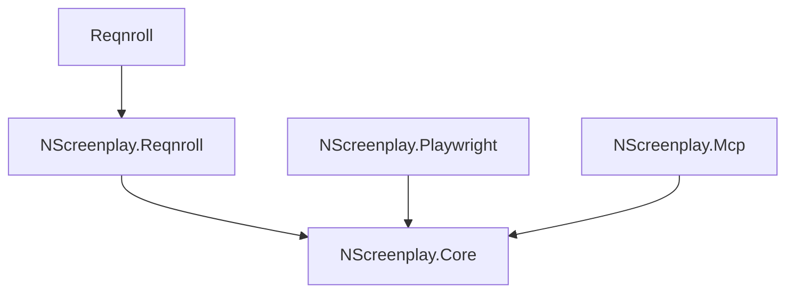

# NScreenplay

[](https://github.com/hadijahangiri/NScreenPlay/actions/workflows/ci.yml)
[](https://www.nuget.org/packages/NScreenplay.Core)
[](https://www.nuget.org/packages/NScreenplay.Playwright)
[](https://www.nuget.org/packages/NScreenplay.Reqnroll)

An AI-native Screenplay Test Automation Framework for .NET.

NScreenplay organizes automation around this flow:

Actor -> Ability -> Task -> Interaction -> Question -> Consequence

## What It Solves

- Keeps tests in business language instead of low-level UI scripts
- Centralizes selectors and endpoint metadata in Targets
- Preserves existing test frameworks while adopting Screenplay abstractions
- Exposes deterministic MCP tools for AI-assisted discovery, planning, and safe adoption

## Packages

- `NScreenplay.Core`: Screenplay abstractions (`Actor`, `IAbility`, `ITask`, `IInteraction`, `IQuestion<T>`, `IConsequence`, `Target`)
- `NScreenplay.Playwright`: Playwright integration (`BrowseTheWeb`, Interactions, Questions)
- `NScreenplay.Reqnroll`: Reqnroll integration (`ScenarioActor`, hooks, browser lifecycle)
- `NScreenplay.Mcp`: MCP server (tooling layer, not a NuGet package)

## Install

```bash
dotnet add package NScreenplay.Core --version 0.1.0
```

If the project uses Playwright:

```bash
dotnet add package NScreenplay.Playwright --version 0.1.0
```

If the project uses Reqnroll:

```bash
dotnet add package NScreenplay.Reqnroll --version 0.1.0
```

## Quick Start (xUnit + Playwright)

```csharp
using Microsoft.Playwright;
using NScreenplay.Core;
using NScreenplay.Playwright;

static class LoginPage
{
    public static Target Username = Target.The("username field").ByTestId("username-input");
    public static Target Password = Target.The("password field").ByTestId("password-input");
    public static Target LoginButton = Target.The("login button").ByTestId("login-button");
}

await using IPlaywright playwright = await Playwright.CreateAsync();
await using var browser = await playwright.Chromium.LaunchAsync(new BrowserTypeLaunchOptions { Headless = true });
await using var page = await browser.NewPageAsync();

var actor = Actor.Named("Alice");
actor.Can(BrowseTheWeb.Using(page));

await actor.AttemptsTo(Navigate.To("https://example.com/login"));
await actor.AttemptsTo(Enter.TheValue("alice@example.com").Into(LoginPage.Username));
await actor.AttemptsTo(Enter.TheValue("secret123").Into(LoginPage.Password));
await actor.AttemptsTo(Click.On(LoginPage.LoginButton));
```

## Reqnroll Integration

Reqnroll is preserved. NScreenplay does not replace it.

Use `ScenarioActor` in step definitions and keep steps thin:

```csharp
public LoginSteps(ScenarioActor scenario) => _scenario = scenario;
```

See [docs/reqnroll.md](docs/reqnroll.md) and `samples/Login`.

## AI Adoption Workflow (MCP)

Canonical playbook: [docs/external-agent-adoption.md](docs/external-agent-adoption.md)

Canonical flow:

Analyze -> Plan -> Human Approval -> Apply -> Validate

Required MCP tools:

1. `nscreenplay_analyze_project`
2. `nscreenplay_create_adoption_plan`
3. `nscreenplay_apply_adoption_plan` (only after explicit approval)

Safety boundaries:

- no shell/PowerShell/arbitrary script execution
- apply executes only explicit validated plan actions
- workspace-root and path safety checks are enforced

## Skills

This repository includes **7 reusable AI Agent Skills** designed to guide AI agents (Claude, GitHub Copilot, Cursor, Cline, etc.) in working effectively with the NScreenplay framework.

Each skill is a standalone markdown file with YAML frontmatter for discovery via [skills.sh](https://skills.sh):

### Available Skills

| Skill | Path | Purpose |
|-------|------|---------|
| **Screenplay** | [`skills/screenplay/SKILL.md`](skills/screenplay/SKILL.md) | Apply the Screenplay Pattern to .NET test automation |
| **Playwright** | [`skills/playwright/SKILL.md`](skills/playwright/SKILL.md) | Use Playwright integration with BrowseTheWeb, Targets, Interactions, Questions |
| **Reqnroll** | [`skills/reqnroll/SKILL.md`](skills/reqnroll/SKILL.md) | Create Gherkin features, step definitions, and BDD tests |
| **Test Authoring** | [`skills/test-authoring/SKILL.md`](skills/test-authoring/SKILL.md) | Follow the complete test creation workflow |
| **Test Review** | [`skills/test-review/SKILL.md`](skills/test-review/SKILL.md) | Review tests for Screenplay architecture and quality |
| **Failure Analysis** | [`skills/failure-analysis/SKILL.md`](skills/failure-analysis/SKILL.md) | Analyze test failures to determine root cause |
| **Healing** | [`skills/healing/SKILL.md`](skills/healing/SKILL.md) | Propose targeted fixes for failed tests with approval gates |

### Skill Format

Each skill file includes YAML frontmatter:

```yaml
---
name: <skill-name>
description: <brief description of when to use this skill>
---

# Skill Content (Markdown)
...
```

The frontmatter enables discovery by AI agents and skills.sh.

### Using Skills

Skills are **installed and discovered via [skills.sh](https://skills.sh)**:

```bash
npx skills add hadijahangiri/NScreenPlay
```

This registers all 7 skills with your AI agent. Once installed, agents can:

- **List available skills**: See all NScreenplay skills in your tool ecosystem
- **Load skills on demand**: Inject skill content when relevant to the current task
- **Follow skill guidance**: Use skill workflows to maintain Screenplay architecture and best practices

Skills are also discoverable via the NScreenplay MCP server (`nscreenplay_list_skills`, `nscreenplay_get_skill`).

## Architecture



## Documentation

- [Getting started](docs/getting-started.md)
- [Screenplay pattern](docs/screenplay-pattern.md)
- [Playwright integration](docs/playwright.md)
- [Reqnroll integration](docs/reqnroll.md)
- [Reqnroll smoke harness](samples/ReqnrollSmoke/README.md)
- [Project analysis and adoption flow](docs/project-analysis.md)
- [External-agent adoption playbook](docs/external-agent-adoption.md)
- [MCP](docs/mcp.md)
- [AI](docs/ai.md)
- [Skills](docs/skills.md)
- [Healing](docs/healing.md)
- [Architecture](docs/architecture.md)

## Project Structure

- `src/NScreenplay.Core`
- `src/NScreenplay.Playwright`
- `src/NScreenplay.Reqnroll`
- `src/NScreenplay.Mcp`
- `tests/NScreenplay.Core.Tests`
- `tests/NScreenplay.Playwright.Tests`
- `tests/NScreenplay.Reqnroll.Tests`
- `tests/NScreenplay.Mcp.Tests`
- `samples/Login`
- `skills`
- `docs`
 
## License

[MIT License](LICENSE)
