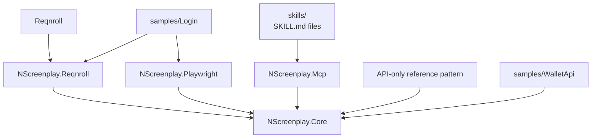

# Architecture

## Overview

## Project Roles

- `NScreenplay.Core` contains the Screenplay abstractions.
- `NScreenplay.Playwright` adapts the abstractions to Playwright.
- `NScreenplay.Reqnroll` manages feature and scenario lifecycles.
- `NScreenplay.Mcp` exposes discovery, analysis, adoption workflow tools, and approval-gated healing tools.
- `samples/Login` demonstrates the supported flow end to end.
- `samples/WalletApi` demonstrates the API-only reference pattern with `xUnit + NScreenplay.Core + custom HttpClient-backed Ability`.

## Limits

The repository is intentionally small and focused. It does not include extra product packages, extra adapter layers, or speculative public APIs beyond what is already in the source tree.
