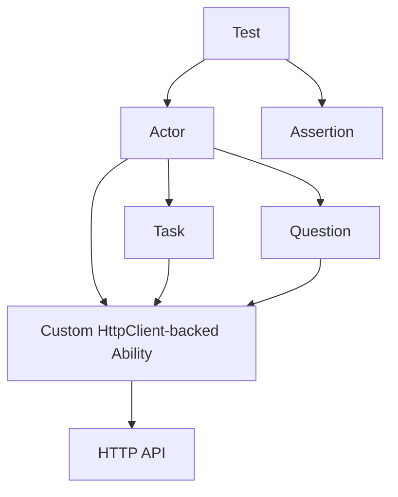

# API-only Screenplay Pattern

`NScreenplay.Core` does not include an official API/HttpClient adapter. For API-only test projects, the supported reference pattern is:

`xUnit + NScreenplay.Core + custom HttpClient-backed Ability`

Use this pattern when a project tests REST or HTTP APIs and does not need browser automation or BDD lifecycle integration.

## Why this pattern exists

API-only tests still benefit from Screenplay boundaries:

- `Actor` owns scenario-scoped abilities
- a custom Ability owns `HttpClient`, base URL, and authentication state
- Tasks represent API commands
- Questions represent API reads
- assertions stay in the test

The ability owns `HttpClient` so the test never manages transport plumbing directly. That keeps HTTP concerns behind the boundary and makes disposal deterministic through `Actor.DisposeAsync()`.

## Recommended shape

## Reference implementation

The repository includes a sample at [samples/WalletApi](../../samples/WalletApi/WalletApi.csproj).

Suggested structure:

- `Api/WalletApiAbility.cs`
- `Tasks/GetWallet.cs`
- `Tasks/CreateWallet.cs`
- `Questions/WalletResponse.cs`
- `Questions/WalletBalance.cs`
- `Tests/WalletTests.cs`

## Responsibilities

### Ability

The Ability should own:

- `HttpClient`
- base URI
- authentication headers or tokens
- request execution
- response parsing
- disposal of HTTP resources

### Task

Tasks should express intent, such as creating or retrieving a wallet. They should not contain assertion logic.

### Question

Questions should read and interpret state. They are the right place to fetch a wallet representation or a computed value such as a balance.

### Test

Tests should stay declarative:

- arrange the actor
- grant the HTTP Ability
- perform a Task
- ask a Question
- assert the result

## Lifecycle

Create the actor per test or per scenario and dispose it with `await using` or an `IAsyncLifetime` fixture. Any Ability that owns disposable HTTP resources should implement `IAsyncDisposable` so `Actor.DisposeAsync()` can clean it up.

## Authentication

Authentication belongs in the Ability. The test should not manually build authorization headers. A Task may trigger login or token acquisition if the API workflow requires it, but the transport plumbing stays behind the Ability.

## Package boundary

This is a reference pattern, not a package.

Do not introduce:

- `NScreenplay.Api`
- `NScreenplay.BDDfy`
- any fake adapter to make the sample look more complete

## Verdict

For API-only testing, the clean default is still `NScreenplay.Core + custom HttpClient-backed Ability`.