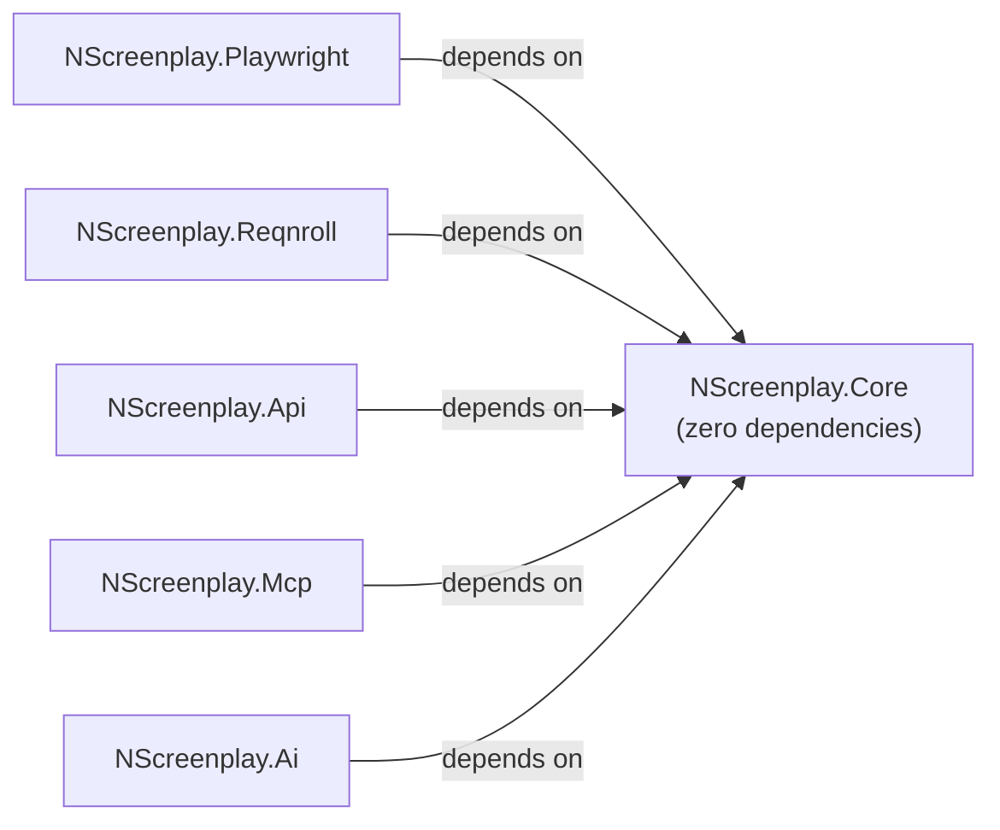
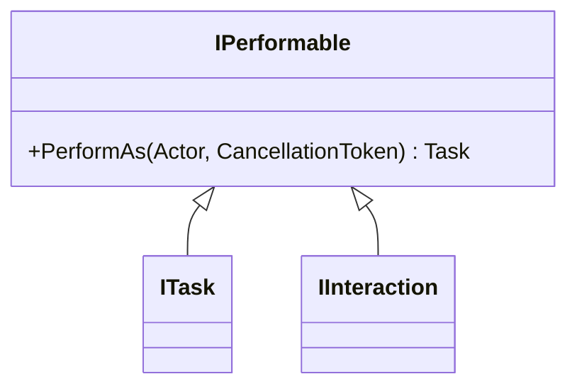

# NScreenplay.Core — Architecture

## Overview

`NScreenplay.Core` is the heart of the framework. It defines the Screenplay vocabulary as pure .NET abstractions with zero dependencies on Playwright, Reqnroll, or any test runner.

```mermaid
graph TD
    Actor -->|owns| IAbility
    Actor -->|attempts| IPerformable
    Actor -->|asks for| IQuestion
    Actor -->|should| IConsequence
    IPerformable <|-- ITask
    IPerformable <|-- IInteraction
    ITask -->|composes| IInteraction
    IInteraction -->|uses| Target
    IQuestion -->|inspects| Target
```

## Dependency Graph



The dependency graph is strictly acyclic. Core is isolated.

## Core Concepts

### Actor

The central entity. An Actor:

- Has a human-readable `Name` (used in logs and error messages).
- Owns a typed collection of `IAbility` instances.
- Executes `IPerformable` items (tasks or interactions).
- Asks `IQuestion<T>` instances.
- Evaluates `IConsequence` expectations.

**Mutability Decision**: Actor is mutable with respect to abilities (`Can()` modifies the instance). This is intentional — a test scenario may add abilities progressively (e.g., after login). The alternative (immutable copy-on-add) would require awkward rebinding at every call site. Actor instances are scenario-scoped and must not be shared across parallel tests.

**No global state**: There is no `Actor.Current`, no `AsyncLocal<Actor>`, no service locator. Each test creates and owns its actor instance.

```csharp
var actor = Actor.Named("Alice");
actor.Can(new SomeAbility());

await actor.AttemptsTo(DoSomething.Now());
var result = await actor.AsksFor(SomeQuestion.About("x"));
await actor.Should(SomethingIsTrue.ForNow());
```

### IAbility

A marker interface for capabilities. Abilities carry whatever state the integration needs (e.g., a Playwright `IPage`, an `HttpClient`).

Core defines the contract. Integration packages provide implementations:

| Package | Ability |
|---------|---------|
| NScreenplay.Playwright | `BrowseTheWeb` |
| NScreenplay.Api | `CallAnApi` |

Retrieval is strongly typed:

```csharp
var ability = actor.GetAbility<BrowseTheWeb>(); // throws MissingAbilityException if absent
bool has = actor.HasAbility<BrowseTheWeb>();
```

No string-based lookup. No service locator.

### IPerformable / ITask / IInteraction



Both implement `IPerformable` so `actor.AttemptsTo(...)` accepts either without overloading.

- **ITask**: Business-level. Composes interactions. Example: `Login.WithCredentials(...)`.
- **IInteraction**: Atomic. One action. Example: `Click.On(target)`.

The distinction is semantic and architectural — enforced by naming convention and code review, not by the type system.

### Target

A semantic description of something the automation adapter locates.

```csharp
public static Target Username    = Target.The("username field").ByLabel("Username");
public static Target LoginButton = Target.The("login button").ByRole("button", "Sign in");
```

**Critical**: Target contains zero Playwright types. It carries `LocatorStrategy` records (CSS, XPath, Role, Label, Id, TestId, Text, Placeholder, AltText). Adapters (e.g., `NScreenplay.Playwright`) translate these into native locators.

Target is immutable. The fluent builder returns new instances.

### IQuestion\<T>

Read-only query. Returns a typed answer. Must not mutate state.

```csharp
// future usage:
var title = await actor.AsksFor(Text.Of(Dashboard.Title));
var code  = await actor.AsksFor(LastResponse.StatusCode());
```

### IConsequence

Verification. Must throw a meaningful exception when the expectation fails. Not tied to any specific assertion library (xUnit, NUnit, FluentAssertions all work).

```csharp
// future usage:
await actor.Should(See.That(Dashboard.IsDisplayed()));
```

## Execution Model

```
actor.AttemptsTo(task)
    └── task.PerformAs(actor, ct)
            └── actor.AttemptsTo(interaction)
                    └── interaction.PerformAs(actor, ct)
                            └── ability = actor.GetAbility<BrowseTheWeb>()
                                // use ability to do real work
```

## Async Model

All execution APIs are async-first:

```csharp
Task AttemptsTo(IPerformable performable, CancellationToken ct = default)
Task AttemptsTo(IEnumerable<IPerformable> performables, CancellationToken ct = default)
Task<T> AsksFor<T>(IQuestion<T> question, CancellationToken ct = default)
Task Should(IConsequence consequence, CancellationToken ct = default)
Task Should(IEnumerable<IConsequence> consequences, CancellationToken ct = default)
```

`CancellationToken` defaults to `default` for ergonomic call sites but is always forwarded internally. `ConfigureAwait(false)` is used in `AttemptsTo(IEnumerable<...>)` to avoid deadlocks in SynchronizationContext-bound environments (e.g., older ASP.NET).

## Cancellation

- Single performable: `PerformAs` receives the token; it is the performable's responsibility to respect it.
- Enumerable performable: `ThrowIfCancellationRequested()` is called before each item.
- Same pattern for `Should(IEnumerable<IConsequence>)`.

## Error Handling

**Principle: don't swallow. Don't wrap unnecessarily.**

- Exceptions from performables/questions/consequences propagate unchanged.
- Framework-specific exceptions exist only where they add real context:
  - `MissingAbilityException` — carries `ActorName` and `AbilityType`, human-readable message.
  - `ScreenplayException` (base) — reserved for framework-level errors.
- No `try/catch` wrapping of user code in Actor.

## State Management

| What | Policy |
|------|--------|
| `static Actor.Current` | ❌ Forbidden |
| `AsyncLocal<Actor>` | ❌ Forbidden |
| Service locator | ❌ Forbidden |
| Instance-level ability dictionary | ✅ Actor-scoped only |
| Scenario-local state in abilities | ✅ Ability-owned |

## Public API Inventory

| Type | Visibility | Consumer | Extensible? |
|------|-----------|----------|-------------|
| `Actor` | `public sealed class` | Tests, step definitions | No |
| `IAbility` | `public interface` | Integration packages, tests | Yes — implement in any package |
| `IPerformable` | `public interface` | All callers | Yes |
| `ITask` | `public interface` | Business task authors | Yes |
| `IInteraction` | `public interface` | Interaction authors | Yes |
| `IQuestion<T>` | `public interface` | Question authors | Yes |
| `IConsequence` | `public interface` | Consequence authors | Yes |
| `Target` | `public sealed class` | Page objects, interactions | No (immutable builder) |
| `LocatorStrategy` | `public sealed record` | Adapter packages only | No |
| `LocatorStrategyKind` | `public enum` | Adapter packages only | No |
| `ScreenplayException` | `public class` | Framework authors | Yes — subclass |
| `MissingAbilityException` | `public sealed class` | Test failure analysis | No |

## Extension Model

To add capabilities:
1. Implement `IAbility` → provide new ability in integration package.
2. Implement `ITask` or `IInteraction` → add new performables.
3. Implement `IQuestion<T>` → add new queries.
4. Implement `IConsequence` → add new verification patterns.
5. Translate `Target.Strategies` → adapter-specific locator resolution.

No plugin registration system is needed. The actor accepts any `IAbility`. Adapters discover target strategies by examining `LocatorStrategy.Kind`.

## Actor Lifecycle (IAsyncDisposable)

Actor implements `IAsyncDisposable`. When disposed, it calls `DisposeAsync` on all abilities that also implement `IAsyncDisposable`. Non-disposable abilities are silently skipped. Disposal is idempotent.

```csharp
// Scenario-scoped lifecycle pattern:
await using var actor = Actor.Named("Alice");
actor.Can(new BrowseTheWeb(page));    // will be disposed when actor is disposed
await actor.AttemptsTo(...);
// actor.DisposeAsync() called automatically here — Playwright page released
```

This enables clean Reqnroll integration without static state:

```csharp
// NScreenplay.Reqnroll (future):
[AfterScenario]
public async Task DisposeActor()
{
    if (scenarioContext.TryGetValue<Actor>(out var actor))
        await actor.DisposeAsync();
}
```

## Playwright Integration (future)

Target strategies map directly to Playwright locator factory methods:

| LocatorStrategyKind | Playwright API |
|--------------------|--------------------|
| `Css` | `page.Locator(css)` |
| `Role` | `page.GetByRole(role, name)` |
| `Label` | `page.GetByLabel(text)` |
| `TestId` | `page.GetByTestId(id)` |
| `Text` | `page.GetByText(text)` |
| `Placeholder` | `page.GetByPlaceholder(text)` |
| `AltText` | `page.GetByAltText(text)` |
| `Id` | `page.Locator("#id")` |
| `XPath` | `page.Locator(xpath)` |

No Playwright types appear in Core. The Playwright adapter resolves `Target.Strategies` independently.

## AI/MCP Discovery (future)

Marker interfaces enable reflection-based discovery without Core changes:

- `ITask` → discover available business actions
- `IInteraction` → discover atomic operations  
- `IQuestion<T>` → discover state queries
- `IAbility` → discover registered capabilities
- `Target` static fields → discover UI element vocabulary

## Milestone 2 Changes

Changes from Milestone 1:
1. **Actor implements `IAsyncDisposable`** — enables clean lifecycle management for Reqnroll and `await using` patterns
2. **`AttemptsTo(single)` pre-checks cancellation** — consistent behavior with enumerable overload
3. **Target builder validates inputs** — all builder methods throw `ArgumentException` for null/empty values


| Aspect | Boa Constrictor | NScreenplay.Core |
|--------|----------------|-----------------|
| Actor mutability | Mutable | Mutable (by design) |
| Ability lookup | Strongly typed | Strongly typed |
| Performable hierarchy | `ITask`, `IQuestion` separate | `ITask`, `IInteraction` both implement `IPerformable` |
| Question return | `TAnswer` | `TAnswer` |
| Target abstraction | `IWebLocator` (Selenium-bound) | `Target` (adapter-neutral) |
| Async | Partial | Async-first throughout |
| CancellationToken | Not present | Supported at every boundary |
| Dependencies in Core | Selenium + more | Zero |
| .NET version | .NET Standard 2.0 | .NET 10 |

**What we intentionally copied conceptually**: Actor/Ability/Task/Question/Consequence vocabulary, strongly typed ability retrieval, separation of business tasks from interactions.

**What we intentionally changed**:
- `IInteraction` as distinct semantic type (Boa merges with task at some levels)
- `Target` is adapter-neutral (Boa's `IWebLocator` is Selenium-specific)
- Async-first (Boa is sync-primary)
- CancellationToken as first-class citizen
- Zero third-party dependencies in Core
- .NET 10 idioms (records, collection expressions, `ArgumentException.ThrowIfNullOrWhiteSpace`)
