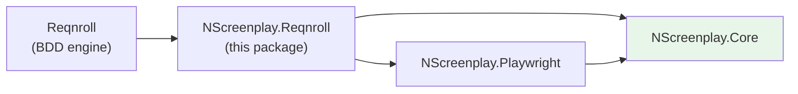
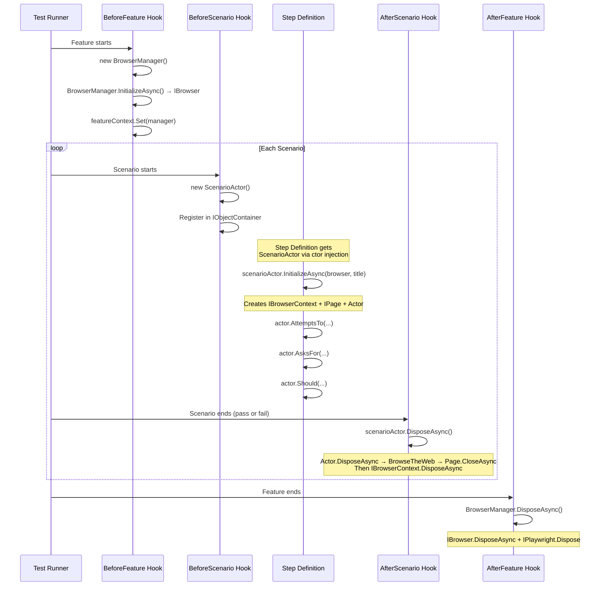

# NScreenplay.Reqnroll — Architecture

## Dependency Graph



**Core never references Reqnroll.** The dependency flows one way only.

## Lifecycle



## Scopes

| Resource | Scope | Owner | Disposed by |
|----------|-------|-------|-------------|
| `IPlaywright` | Feature | `BrowserManager` | `AfterFeature` hook |
| `IBrowser` | Feature | `BrowserManager` | `AfterFeature` hook |
| `IBrowserContext` | Scenario | `ScenarioActor` | `AfterScenario` hook |
| `IPage` | Scenario | `BrowseTheWeb` (via Actor) | `Actor.DisposeAsync` |
| `Actor` | Scenario | `ScenarioActor` | `AfterScenario` hook |

**Ownership rule**: each resource is disposed by exactly one owner. No double-disposal.

## Actor Lifecycle

```
[BeforeScenario]
  └── new ScenarioActor() registered in IObjectContainer

[First step or [BeforeScenario] order 2]
  └── scenarioActor.InitializeAsync(browser, "Scenario Title")
        ├── browser.NewContextAsync() → IBrowserContext
        ├── context.NewPageAsync()    → IPage
        ├── Actor.Named("Scenario Title")
        └── actor.Can(BrowseTheWeb.Using(page))

[Step Definitions]
  └── scenarioActor.Actor.AttemptsTo(...)

[AfterScenario]
  └── scenarioActor.DisposeAsync()
        ├── actor.DisposeAsync()
        │     └── BrowseTheWeb.DisposeAsync() → page.CloseAsync()
        └── context.DisposeAsync()
```

## Playwright Lifecycle

Playwright's recommended isolation model: **one `IBrowserContext` per scenario**.

- Browser is expensive (process startup) → shared at feature scope
- BrowserContext is cheap and provides full isolation (cookies, storage, cache)
- Page is cheap → one per scenario

This matches Playwright's own testing guidance for parallel test execution.

## Dependency Injection

Reqnroll uses **BoDi** as its built-in DI container.

`ScenarioActor` is registered per-scenario:

```csharp
// Inside NScreenplayHooks [BeforeScenario]:
_scenarioContainer.RegisterInstanceAs(new ScenarioActor());
```

Step definitions receive it via constructor injection:

```csharp
public class LoginSteps
{
    private readonly ScenarioActor _scenario;

    public LoginSteps(ScenarioActor scenario) => _scenario = scenario;

    [Given("the user is on the login page")]
    public async Task NavigateToLoginPage()
    {
        await _scenario.InitializeAsync(...);
        await _scenario.Actor.AttemptsTo(Navigate.To("/login"));
    }

    [When("the user logs in with valid credentials")]
    public async Task Login()
    {
        await _scenario.Actor.AttemptsTo(
            Login.WithCredentials("user@example.com", "pass")
        );
    }
}
```

**No static Actor. No `AsyncLocal<Actor>`. No service locator.**

## Parallel Execution

Each scenario has:
- Its own `ScenarioActor` instance
- Its own `IBrowserContext` (isolated cookies, storage)
- Its own `IPage`
- Its own `Actor`

Feature-level `IBrowser` is shared but is read-only after launch — safe for parallel access.

**Result: parallel scenarios cannot contaminate each other.**

## Configuration

```csharp
// In [BeforeTestRun] hook or assembly-level initialization:
NScreenplayConfiguration.Configure(new NScreenplayOptions
{
    Browser = "chromium",
    Headless = false,       // headed for local debugging
    BaseUrl = "https://myapp.com",
    TimeoutMilliseconds = 30_000,
});
```

Defaults: headless Chromium, localhost base URL, 30s timeout.

## Teardown and Failure Handling

`[AfterScenario]` runs regardless of test outcome (pass or fail).

If `scenarioActor.DisposeAsync()` throws during teardown:
- The original test failure remains the reported failure
- Disposal exceptions are propagated from `Actor.DisposeAsync` which uses the "dispose all, rethrow first" pattern
- Resources not yet disposed continue to be attempted

**The original scenario failure is never hidden.**
